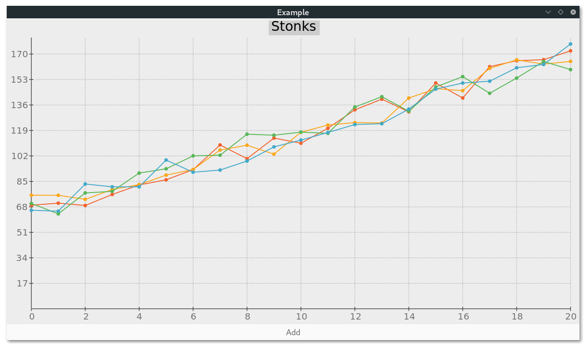

# ugly-charts (WIP)
Charting library for [gotk3](https://github.com/gotk3/gotk3)

It is by no means ready for wide use, but it satisfies my limited use case,
and I will keep working on it as my requirements grow.

## What works
* Line charts
* Multiple series
* Customising marker size/line width
* Autoranging axis
* Partial drawing
* Title

## What doesn't
* Everything else

## What's planned
* Area charts, scatter charts
* Legend
* Integer series (maybe)
* Calculate decimal ticks properly
* Make it usable for use cases other than trivial positive-not-very-big-numbers 

